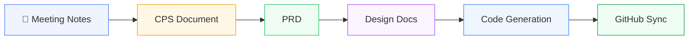
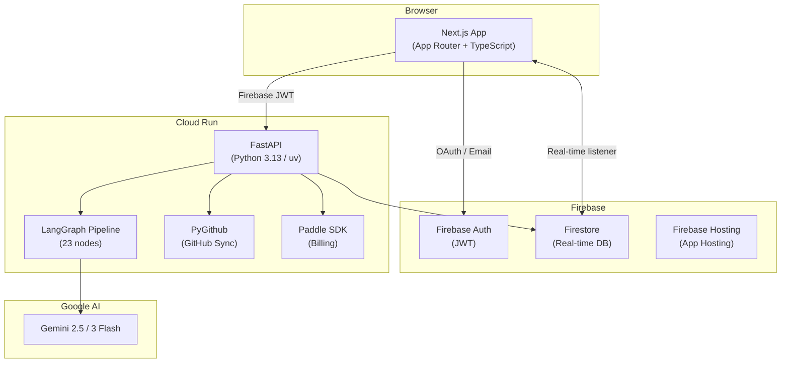
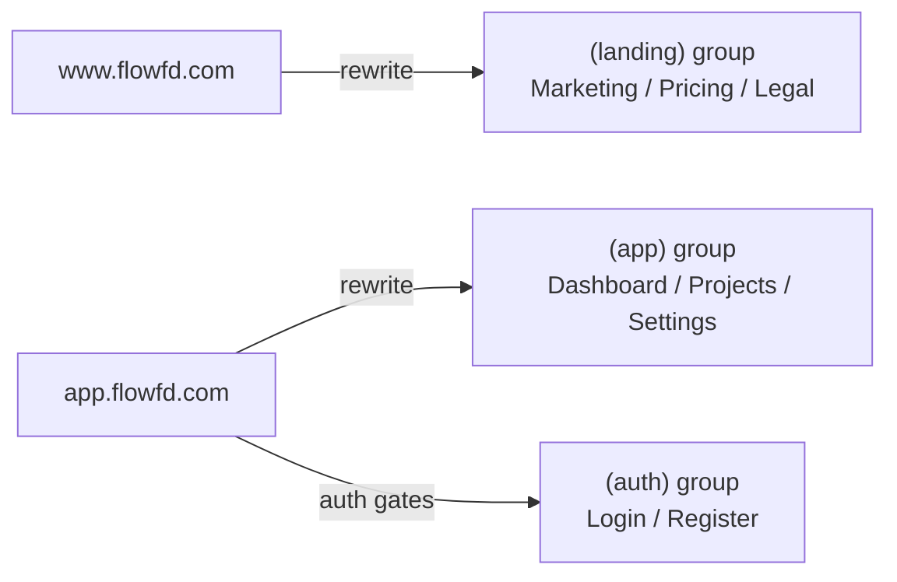
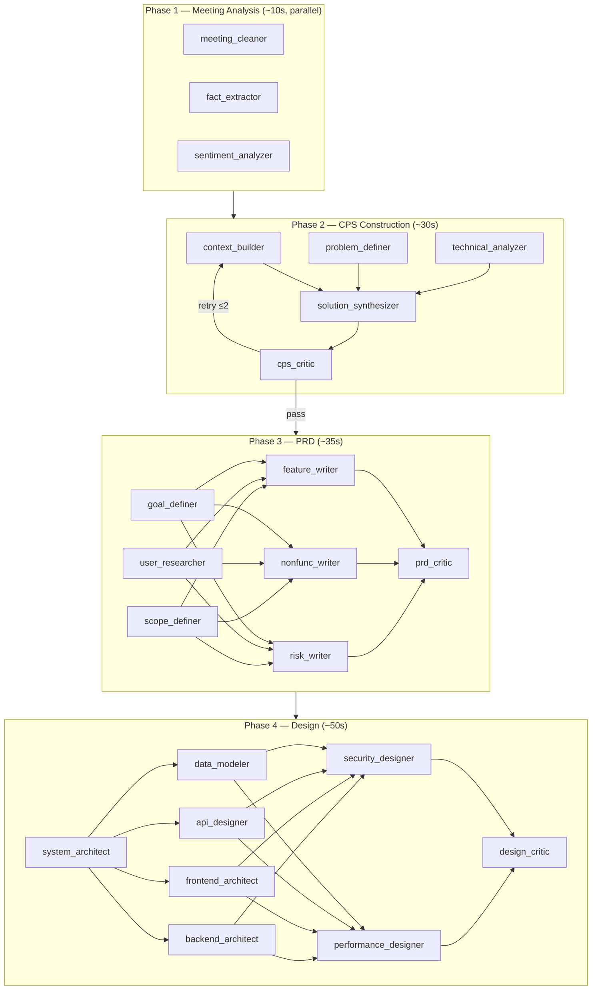
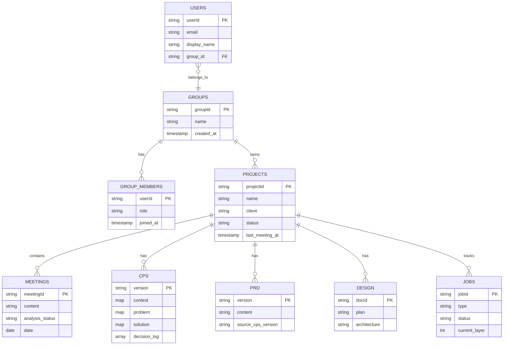
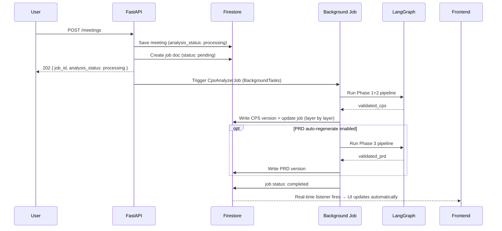

# FlowFD

🌐 [한국어](README_KO.md) | **English**

**FlowFD** is a SaaS platform that automates the full workflow of a Forward Deployed Engineer (FDE) — from raw meeting notes to structured documents, architecture design, code generation, and GitHub sync.

---

## Production-Ready SaaS

FlowFD is not a prototype. It is a fully deployable SaaS with every layer wired up end-to-end:

| Layer | What's included |
|-------|----------------|
| **Infrastructure** | Google Cloud Run (auto-scaling container), Firebase App Hosting, Firestore |
| **Auth & Multi-tenancy** | Firebase Auth (email + Google OAuth), group-based data isolation — solo users and teams share the same model |
| **AI Pipeline** | 23-node LangGraph pipeline across 4 phases, parallel execution, retry logic, structured Gemini output |
| **Billing** | Paddle Billing as Merchant of Record — subscription (monthly/annual), one-time credit top-ups, webhook handling, idempotent credit grants, cancellation/renewal lifecycle |
| **Credit System** | Per-action credit metering, deduction priority (subscription first → purchased), balance guards before every pipeline run |
| **GitHub Integration** | Human-in-the-loop sync — diff preview before every commit, auto-structured repo layout |
| **i18n** | Korean / English with `next-intl`, user-level language preference |
| **Legal** | Terms of Service, Privacy Policy, Refund Policy, Pricing page |
| **CI/CD** | GitHub Actions → Cloud Run (backend) + Firebase App Hosting (frontend), automatic on push |

---

## What it does

An FDE typically spends hours every week converting unstructured meeting notes into CPS documents, PRDs, design specs, and code scaffolds. FlowFD automates this pipeline end-to-end.



| Stage | What happens |
|-------|-------------|
| **Meeting** | Raw notes are saved and preserved. An AI pipeline triggers automatically. |
| **CPS** | Context / Problem / Solution document is generated and incrementally updated with each new meeting. |
| **PRD** | Product Requirements Document is drafted from the CPS and kept in sync. |
| **Design** | System architecture, data model, API spec, frontend/backend structure, and security design are generated. |
| **Code** | Code scaffolds are generated from the design, then linted with Ruff. |
| **GitHub Sync** | A human-in-the-loop sync commits all documents and code to a GitHub repo. |

---

## System Architecture



---

## Domain Routing

A single Next.js app handles two subdomains via `middleware.ts`:



---

## AI Pipeline (LangGraph)

Each meeting triggers a multi-phase LangGraph pipeline. Nodes run in parallel where possible.



**Credit costs:** Smart analysis (Phase 1+2) = 5 credits · PRD (Phase 3) = 10 · Design (Phase 4) = 15 · Full pipeline = 30

---

## Firestore Data Model

All project data lives under a **group** (team), not directly under a user. This ensures teams can share projects and enables future RAG over the full group knowledge base.



---

## LLM — Current State & Extensibility

### Currently: Gemini only

The AI pipeline (`backend/app/crew/nodes.py`) is hardcoded to `ChatGoogleGenerativeAI`. All 23 nodes call Gemini via `langchain-google-genai`. The model is tiered by node complexity:

```python
MODEL_CONFIG = {
    # Light — extraction / cleaning
    "fact_extractor":        "gemini-2.5-flash-lite",
    "sentiment_analyzer":    "gemini-2.5-flash-lite",
    "frontend_architect":    "gemini-2.5-flash-lite",
    ...

    # Medium — classification / analysis
    "context_builder":       "gemini-2.5-flash",
    "problem_definer":       "gemini-2.5-flash",

    # Heavy — synthesis / critics / design
    "cps_critic":            "gemini-3-flash-preview",
    "solution_synthesizer":  "gemini-3-flash-preview",
    "system_architect":      "gemini-3-flash-preview",
    ...
}
```

One `GEMINI_API_KEY` in `.env` covers everything. No per-node configuration needed.

### Adding other providers

`langchain-anthropic` and `langchain-openai` are already installed (see `pyproject.toml`) but not wired in yet. Swapping a node to a different provider means changing one line in `MODEL_CONFIG` and replacing `ChatGoogleGenerativeAI` with the corresponding LangChain chat class — the rest of the pipeline (state, structured output, retry logic) is provider-agnostic.

The `get_llm()` helper already accepts an optional `api_key` parameter so user-supplied keys (stored encrypted in Firestore) can be passed through without touching the environment.

---

## Tech Stack

| Layer | Technology |
|-------|-----------|
| Frontend | Next.js (App Router), TypeScript, Tailwind CSS, shadcn/ui |
| Frontend Hosting | Firebase App Hosting |
| Backend | FastAPI, Python 3.13, uv |
| Backend Infra | Google Cloud Run |
| Database | Firestore |
| Auth | Firebase Auth |
| AI Orchestration | LangGraph + LangChain |
| LLM | Gemini 2.5 Flash / Flash-Lite · Gemini 3 Flash (model mix) |
| GitHub Integration | PyGithub |
| Payments | Paddle Billing (Merchant of Record) |
| Linter | Ruff |
| i18n | next-intl (Korean default, English) |

---

## Repo Structure

```
FlowFD/
├── frontend/                   Next.js monolith
│   ├── app/
│   │   ├── (landing)/          www.flowfd.com — marketing, pricing, legal
│   │   ├── (auth)/             login, register
│   │   └── (app)/              dashboard, projects, settings, billing
│   ├── components/             cps/ meeting/ prd/ project/ settings/ ui/
│   ├── lib/
│   │   ├── api/                typed API clients per domain
│   │   └── firebase/           auth, firestore, analytics
│   ├── messages/               en.json, ko.json
│   ├── middleware.ts            subdomain routing (www ↔ app)
│   └── types/                  shared TypeScript types
│
├── backend/                    FastAPI service
│   └── app/
│       ├── routers/            one router per domain
│       ├── services/           business logic
│       ├── jobs/               background pipeline jobs
│       ├── crew/               LangGraph nodes, pipeline, schemas
│       ├── models/             Pydantic models
│       ├── prompts/            LLM prompt templates
│       └── core/               auth, firestore client, config, credits
│
└── docs/                       Design docs (naming, PRD, UI spec, etc.)
```

---

## Background Job Flow



---

## Getting Started

### Prerequisites

- Node.js 20+ and npm
- Python 3.13+ and [uv](https://docs.astral.sh/uv/)
- A Firebase project (Firestore + Auth enabled)
- A Google AI Studio API key (Gemini)

### Backend

```bash
cd backend
cp .env.example .env          # fill in Firebase + Gemini credentials
uv sync
uv run uvicorn app.main:app --reload --port 8000
```

### Frontend

```bash
cd frontend
cp .env.example .env.local    # fill in Firebase public config + API base URL
npm install
npm run dev                   # http://localhost:3000
```

### Environment Variables

**`backend/.env`**
```env
RUN_MODE=debug
FIREBASE_PROJECT_ID=
FIREBASE_SERVICE_ACCOUNT_KEY=serviceAccountKey.json
GEMINI_API_KEY=
ALLOWED_ORIGINS=["http://localhost:3000"]
PADDLE_API_KEY=
PADDLE_WEBHOOK_SECRET=
PADDLE_ENVIRONMENT=sandbox
PADDLE_PRICE_CREDITS_200=
PADDLE_PRICE_CREDITS_500=
PADDLE_PRICE_CREDITS_1000=
PADDLE_PRICE_MONTHLY=
PADDLE_PRICE_ANNUAL=
```

**`frontend/.env.local`**
```env
NEXT_PUBLIC_FIREBASE_API_KEY=
NEXT_PUBLIC_FIREBASE_AUTH_DOMAIN=
NEXT_PUBLIC_FIREBASE_PROJECT_ID=
NEXT_PUBLIC_FIREBASE_STORAGE_BUCKET=
NEXT_PUBLIC_FIREBASE_MESSAGING_SENDER_ID=
NEXT_PUBLIC_FIREBASE_APP_ID=
NEXT_PUBLIC_API_BASE_URL=http://localhost:8000
NEXT_PUBLIC_PADDLE_CLIENT_TOKEN=
NEXT_PUBLIC_PADDLE_ENVIRONMENT=sandbox
```

---

## Deployment

Both services deploy automatically on push via GitHub Actions:

```
push to main
├── frontend/** changed → Firebase App Hosting (www / app subdomains)
└── backend/**  changed → Google Cloud Run
```

---

## Implementation Progress

| Step | Feature | Status |
|------|---------|--------|
| 1 | Project base setup | ✅ |
| 2 | Firebase Auth + group wiring | ✅ |
| 3 | Project CRUD | ✅ |
| 4 | Meeting CRUD + Firestore | ✅ |
| 5 | CPS auto-generation (LangGraph) | ✅ |
| 6 | CPS auto-update (background job) | ✅ |
| 7 | PRD generation & update | ✅ |
| 8 | Design document generation | ✅ |
| 9 | PRD kanban view | ✅ |
| 10 | Meeting save pipeline notifications | ✅ |
| 11 | GitHub Sync | ✅ |
| 12 | Paddle billing (sandbox) | ✅ |
| 13 | Pricing / Terms / Privacy / Refund pages | ✅ |
| 14 | Automation pipeline settings | ✅ |
| 15 | Analysis mode selection | ✅ |
| 16 | Support user llm api-key | 🔜 |
| 17 | Code generation + Ruff linting | 🔜 |
| 18 | Group RAG & project sharing | 🔜 |
| 19 | External integrations (Jira, Slack, Teams) | 🔜 |
| 20 | STT for meeting input | 🔜 |
| 21 | Mobile / tablet version | 🔜 |

---

## Contributing

1. Fork the repository
2. Create a feature branch (`git checkout -b feature/amazing-feature`)
3. Commit your changes (`git commit -m 'Add amazing feature'`)
4. Push to the branch (`git push origin feature/amazing-feature`)
5. Open a Pull Request

---

## License

FlowFD is dual-licensed:

### Personal & Open-Source Use
**License: AGPL-3.0**

Free to use under the [GNU Affero General Public License v3.0](LICENSE) for personal use, non-commercial projects, and open-source development.

### Commercial SaaS Use
SaaS companies and commercial deployments require a separate commercial license.

Contact: hwansys@naver.com

---

## Sponsor

If FlowFD saves you time, consider supporting its development.

[](https://github.com/sponsors/whitebearhands)
