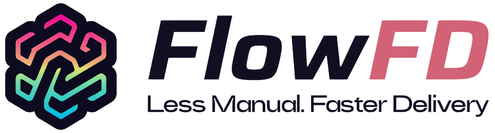
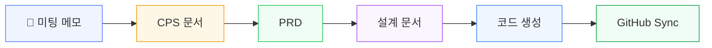
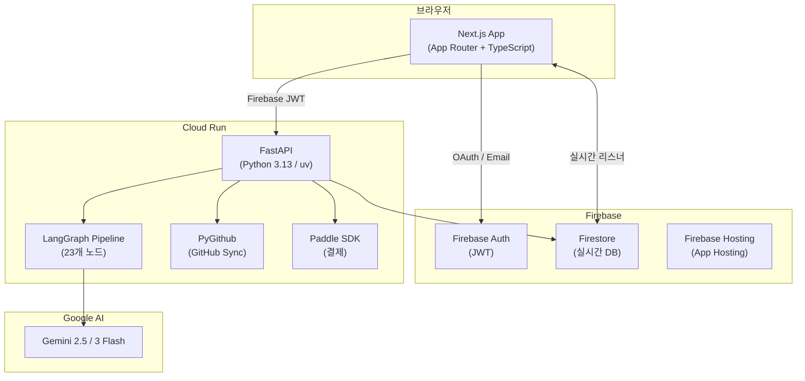
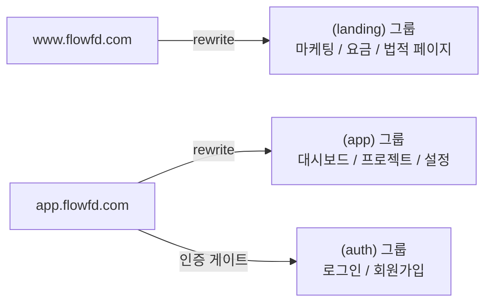
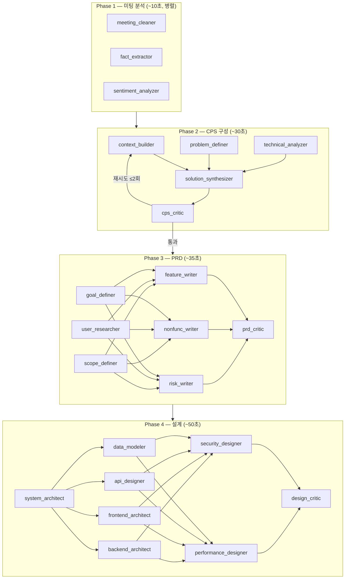
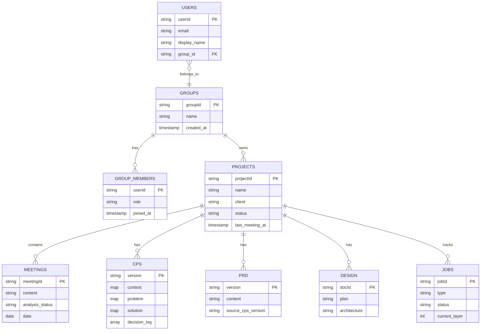
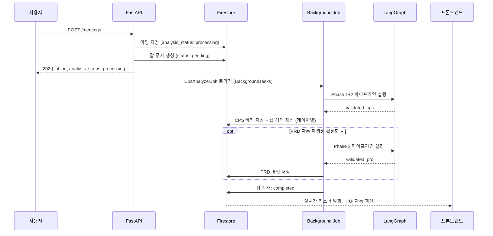

🌐 **한국어** | [English](README.md)

**FlowFD**는 Forward Deployed Engineer(FDE)의 전체 업무를 자동화하는 SaaS 플랫폼입니다.
미팅 메모부터 구조화된 문서, 아키텍처 설계, 코드 생성, GitHub 동기화까지 이어지는 파이프라인을 제공합니다.

---

## 운영 가능한 SaaS

FlowFD는 프로토타입이 아닙니다. 모든 레이어가 끝까지 연결된 실제 배포 가능한 SaaS입니다.

| 레이어 | 포함된 내용 |
|--------|------------|
| **인프라** | Google Cloud Run (자동 스케일링 컨테이너), Firebase App Hosting, Firestore |
| **인증 & 멀티테넌시** | Firebase Auth (이메일 + Google OAuth), 그룹 기반 데이터 격리 — 개인 사용자와 팀이 동일한 구조를 공유합니다 |
| **AI 파이프라인** | 4단계 23개 노드 LangGraph 파이프라인, 병렬 실행, 재시도 로직, 구조화된 Gemini 출력 |
| **결제** | Paddle Billing (Merchant of Record) — 구독(월간/연간), 1회성 크레딧 충전, 웹훅 처리, 멱등성 크레딧 지급, 해지/갱신 수명주기 |
| **크레딧 시스템** | 작업별 크레딧 과금, 차감 우선순위 (구독 → 충전), 파이프라인 실행 전 잔액 가드 |
| **GitHub 연동** | Human-in-the-loop 동기화 — 커밋 전 diff 미리보기, 자동 repo 구조 정리 |
| **다국어(i18n)** | 한국어 / 영어 (`next-intl`), 사용자별 언어 설정 |
| **법적 페이지** | 이용약관, 개인정보 처리방침, 환불 정책, 요금 안내 |
| **CI/CD** | GitHub Actions → Cloud Run(백엔드) + Firebase App Hosting(프론트엔드), 푸시 시 자동 배포 |

---


---

## 무엇을 하는가

FDE는 매주 수 시간을 비정형 미팅 메모를 CPS 문서, PRD, 설계 스펙, 코드 스캐폴드로 변환하는 데 씁니다. FlowFD는 이 파이프라인 전체를 자동화합니다.



| 단계 | 동작 |
|------|------|
| **미팅** | 원본 메모를 그대로 저장·보존합니다. AI 파이프라인이 자동으로 트리거됩니다. |
| **CPS** | Context / Problem / Solution 문서를 생성하고 새 미팅마다 점진적으로 업데이트합니다. |
| **PRD** | CPS를 기반으로 제품 요구사항 문서를 작성하고 동기화를 유지합니다. |
| **설계** | 시스템 아키텍처, 데이터 모델, API 명세, 프론트/백엔드 구조, 보안 설계를 자동 생성합니다. |
| **코드** | 설계 문서 기반으로 코드 스캐폴드를 생성한 후 Ruff로 린팅합니다. |
| **GitHub Sync** | Human-in-the-loop 방식으로 모든 문서와 코드를 GitHub repo에 커밋합니다. |

---

## 시스템 아키텍처



---

## 도메인 라우팅

하나의 Next.js 앱이 `middleware.ts`로 두 서브도메인을 분기합니다.



---

## AI 파이프라인 (LangGraph)

각 미팅이 저장되면 다단계 LangGraph 파이프라인이 트리거됩니다. 가능한 노드는 병렬로 실행됩니다.



**크레딧 비용:** 스마트 분석 (Phase 1+2) = 5크레딧 · PRD (Phase 3) = 10 · 설계 (Phase 4) = 15 · 전체 파이프라인 = 30

---

## Firestore 데이터 모델

모든 프로젝트 데이터는 사용자 하위가 아닌 **그룹(팀)** 하위에 저장됩니다.
팀 단위 프로젝트 공유와 향후 그룹 전체 지식 기반 RAG를 지원하기 위한 구조입니다.



---

## LLM — 현재 상태 & 확장성

### 현재: Gemini 전용

AI 파이프라인(`backend/app/crew/nodes.py`)은 `ChatGoogleGenerativeAI`로 고정되어 있습니다.
23개 노드 전부 `langchain-google-genai`를 통해 Gemini를 호출합니다. 노드 복잡도에 따라 모델을 3단계로 나눠 사용합니다.

```python
MODEL_CONFIG = {
    # 경량 — 추출 / 정제
    "fact_extractor":        "gemini-2.5-flash-lite",
    "sentiment_analyzer":    "gemini-2.5-flash-lite",
    "frontend_architect":    "gemini-2.5-flash-lite",
    ...

    # 중간 — 분류 / 분석
    "context_builder":       "gemini-2.5-flash",
    "problem_definer":       "gemini-2.5-flash",

    # 고성능 — 종합 / 검증 / 설계
    "cps_critic":            "gemini-3-flash-preview",
    "solution_synthesizer":  "gemini-3-flash-preview",
    "system_architect":      "gemini-3-flash-preview",
    ...
}
```

`.env`의 `GEMINI_API_KEY` 하나로 전체 파이프라인이 동작합니다. 노드별 별도 설정은 필요하지 않습니다.

### 다른 provider 추가

`langchain-anthropic`과 `langchain-openai`는 `pyproject.toml`에 이미 설치되어 있지만 아직 파이프라인에 연결되지 않은 상태입니다. 특정 노드를 다른 provider로 교체하려면 `MODEL_CONFIG`의 모델명 한 줄과 `ChatGoogleGenerativeAI`를 해당 LangChain 클래스로 바꾸면 됩니다 — State, Structured Output, 재시도 로직은 provider에 무관합니다.

`get_llm()` 헬퍼는 이미 `api_key` 파라미터를 받도록 설계되어 있어, 나중에 사용자별 API 키(Firestore에 암호화 저장)를 그대로 주입할 수 있습니다.

---

## 기술 스택

| 영역 | 기술 |
|------|------|
| 프론트엔드 | Next.js (App Router), TypeScript, Tailwind CSS, shadcn/ui |
| 프론트엔드 호스팅 | Firebase App Hosting |
| 백엔드 | FastAPI, Python 3.13, uv |
| 백엔드 인프라 | Google Cloud Run |
| 데이터베이스 | Firestore |
| 인증 | Firebase Auth |
| AI 오케스트레이션 | LangGraph + LangChain |
| LLM | Gemini 2.5 Flash / Flash-Lite · Gemini 3 Flash (모델 믹스) |
| GitHub 연동 | PyGithub |
| 결제 | Paddle Billing (Merchant of Record) |
| 린터 | Ruff |
| 다국어 | next-intl (한국어 기본, 영어) |

---

## 레포 구조

```
FlowFD/
├── frontend/                   Next.js 모놀리스
│   ├── app/
│   │   ├── (landing)/          www.flowfd.com — 마케팅, 요금, 법적 페이지
│   │   ├── (auth)/             로그인, 회원가입
│   │   └── (app)/              대시보드, 프로젝트, 설정, 결제
│   ├── components/             cps/ meeting/ prd/ project/ settings/ ui/
│   ├── lib/
│   │   ├── api/                도메인별 타입드 API 클라이언트
│   │   └── firebase/           auth, firestore, analytics
│   ├── messages/               en.json, ko.json
│   ├── middleware.ts            서브도메인 라우팅 (www ↔ app)
│   └── types/                  공통 TypeScript 타입
│
├── backend/                    FastAPI 서비스
│   └── app/
│       ├── routers/            도메인별 라우터
│       ├── services/           비즈니스 로직
│       ├── jobs/               백그라운드 파이프라인 잡
│       ├── crew/               LangGraph 노드, 파이프라인, 스키마
│       ├── models/             Pydantic 모델
│       ├── prompts/            LLM 프롬프트 템플릿
│       └── core/               인증, Firestore 클라이언트, 설정, 크레딧
│
└── docs/                       설계 문서 (네이밍, PRD, UI 명세 등)
```

---

## 백그라운드 잡 흐름



---

## 시작하기

### 사전 준비

- Node.js 20+ 및 npm
- Python 3.13+ 및 [uv](https://docs.astral.sh/uv/)
- Firebase 프로젝트 (Firestore + Auth 활성화)
- Google AI Studio API 키 (Gemini)

### 백엔드

```bash
cd backend
cp .env.example .env          # Firebase + Gemini 자격증명 입력
uv sync
uv run uvicorn app.main:app --reload --port 8000
```

### 프론트엔드

```bash
cd frontend
cp .env.example .env.local    # Firebase 공개 설정 + API 주소 입력
npm install
npm run dev                   # http://localhost:3000
```

### 환경 변수

**`backend/.env`**
```env
RUN_MODE=debug
FIREBASE_PROJECT_ID=
FIREBASE_SERVICE_ACCOUNT_KEY=serviceAccountKey.json
GEMINI_API_KEY=
ALLOWED_ORIGINS=["http://localhost:3000"]
PADDLE_API_KEY=
PADDLE_WEBHOOK_SECRET=
PADDLE_ENVIRONMENT=sandbox
PADDLE_PRICE_CREDITS_200=
PADDLE_PRICE_CREDITS_500=
PADDLE_PRICE_CREDITS_1000=
PADDLE_PRICE_MONTHLY=
PADDLE_PRICE_ANNUAL=
```

**`frontend/.env.local`**
```env
NEXT_PUBLIC_FIREBASE_API_KEY=
NEXT_PUBLIC_FIREBASE_AUTH_DOMAIN=
NEXT_PUBLIC_FIREBASE_PROJECT_ID=
NEXT_PUBLIC_FIREBASE_STORAGE_BUCKET=
NEXT_PUBLIC_FIREBASE_MESSAGING_SENDER_ID=
NEXT_PUBLIC_FIREBASE_APP_ID=
NEXT_PUBLIC_API_BASE_URL=http://localhost:8000
NEXT_PUBLIC_PADDLE_CLIENT_TOKEN=
NEXT_PUBLIC_PADDLE_ENVIRONMENT=sandbox
```

---

## 배포

GitHub Actions로 푸시 시 자동 배포됩니다.

```
main 브랜치 푸시
├── frontend/** 변경 → Firebase App Hosting (www / app 서브도메인)
└── backend/**  변경 → Google Cloud Run
```

---

## 구현 진행 현황

| 단계 | 기능 | 상태 |
|------|------|------|
| 1 | 프로젝트 기반 세팅 | ✅ |
| 2 | Firebase Auth + 그룹 연동 | ✅ |
| 3 | 프로젝트 CRUD | ✅ |
| 4 | 미팅 CRUD + Firestore 저장 | ✅ |
| 5 | CPS 자동 생성 (LangGraph) | ✅ |
| 6 | CPS 자동 업데이트 (백그라운드 잡) | ✅ |
| 7 | PRD 생성 및 업데이트 | ✅ |
| 8 | 설계 문서 생성 | ✅ |
| 9 | PRD 칸반 뷰 | ✅ |
| 10 | 미팅 저장 파이프라인 알림 | ✅ |
| 11 | GitHub Sync | ✅ |
| 12 | Paddle 결제 연동 (sandbox) | ✅ |
| 13 | Pricing / 이용약관 / 개인정보 / 환불 페이지 | ✅ |
| 14 | 자동화 파이프라인 설정 | ✅ |
| 15 | 분석 모드 선택 | ✅ |
| 16 | 사용자의 LLM ApiKey 사용기능 | 🔜 |
| 17 | 코드 생성 + Ruff 린팅 | 🔜 |
| 18 | 그룹 RAG & 프로젝트 공유 | 🔜 |
| 19 | 외부 툴 연동 (Jira, Slack, Teams) | 🔜 |
| 20 | 미팅 입력 STT | 🔜 |
| 21 | 모바일 / 태블릿 버전 | 🔜 |

---

## 기여하기

1. 리포지토리를 포크합니다
2. 기능 브랜치를 생성합니다 (`git checkout -b feature/멋진기능`)
3. 변경사항을 커밋합니다 (`git commit -m '멋진 기능 추가'`)
4. 브랜치에 푸시합니다 (`git push origin feature/멋진기능`)
5. Pull Request를 생성합니다

---

## 라이선스

FlowFD는 이중 라이선스로 제공됩니다.

### 개인 및 오픈소스 사용
**라이선스: AGPL-3.0**

개인 사용, 비상업적 프로젝트, 오픈소스 개발에는 [GNU Affero General Public License v3.0](LICENSE)에 따라 무료로 사용 가능합니다.

### 상업적 SaaS 사용
SaaS 기업 및 상업적 배포에는 별도의 상업 라이선스가 필요합니다.

문의: hwansys@naver.com

---

## 후원

FlowFD가 업무에 도움이 되셨다면, 개발을 응원해 주세요.

[](https://github.com/sponsors/whitebearhands)
