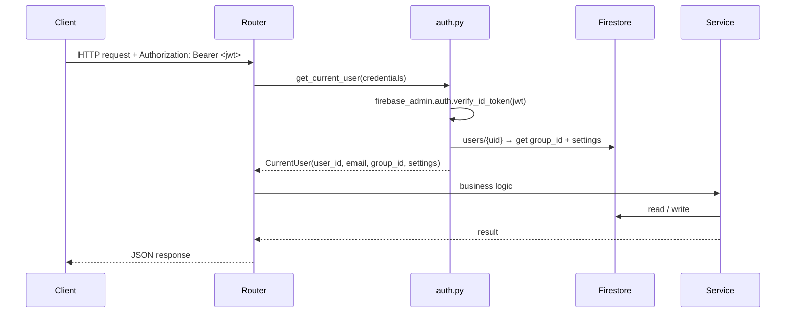
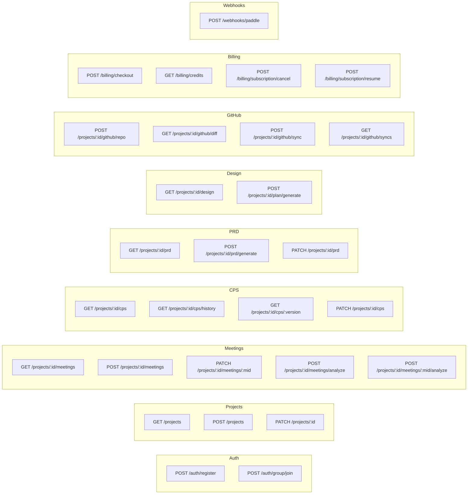
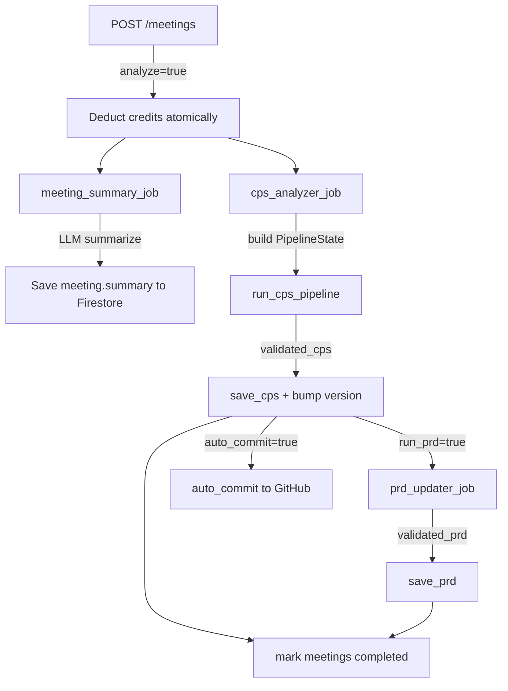
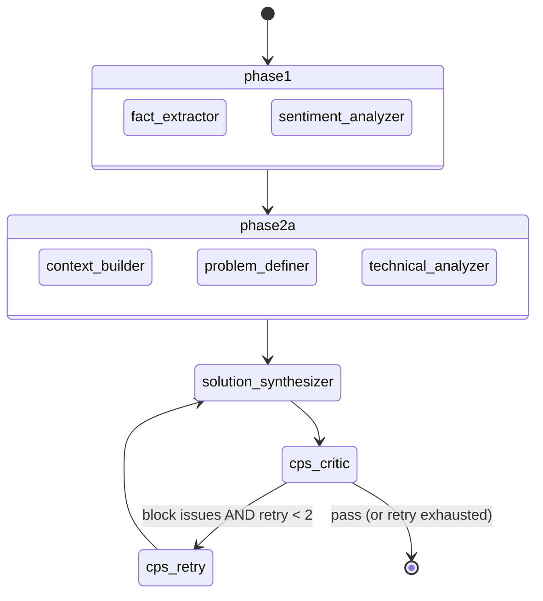
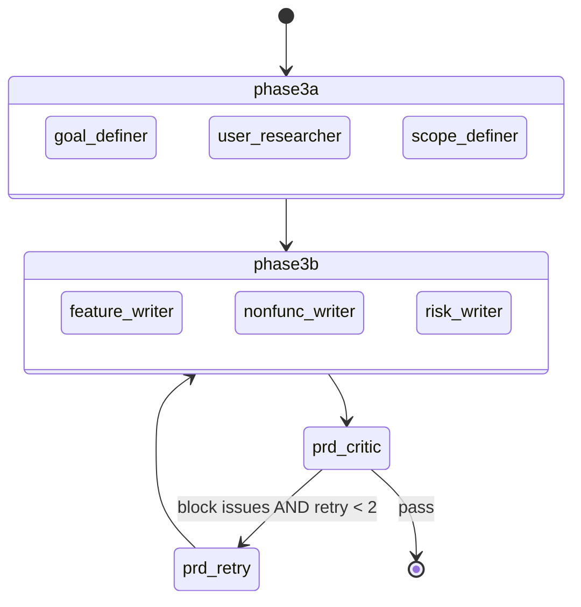
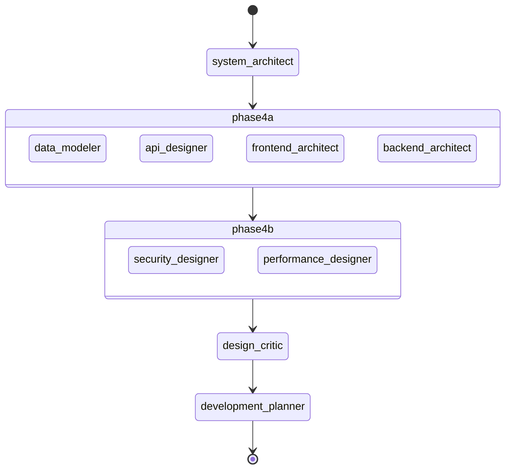
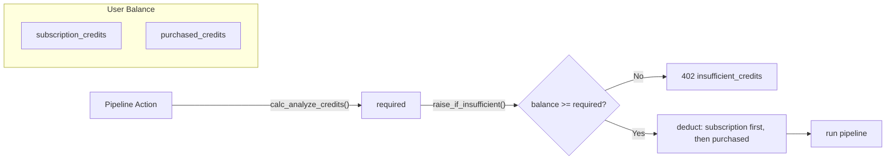
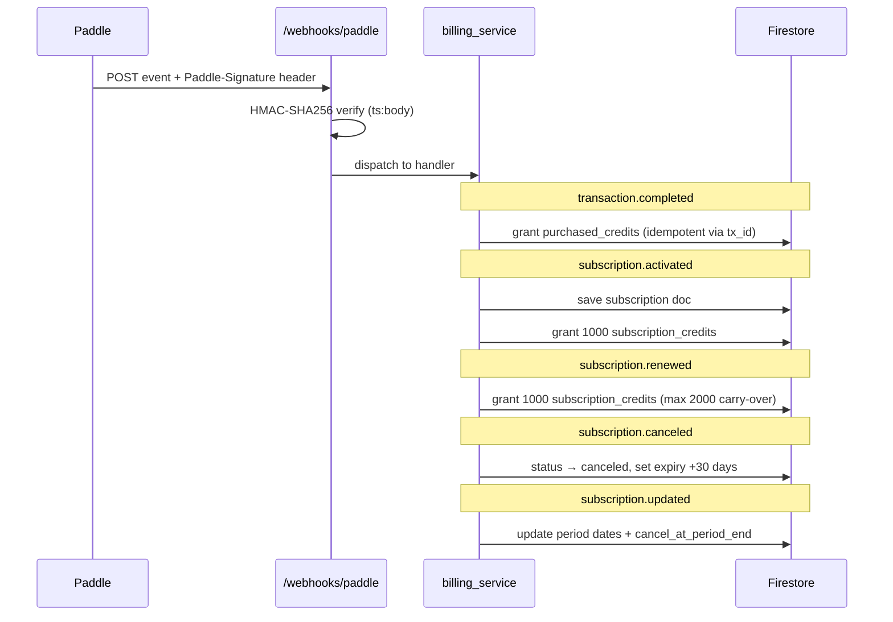

# FlowFD Backend

FastAPI service that powers the FlowFD pipeline — meeting notes → CPS → PRD → Design documents.

- **Runtime**: Python 3.13, [uv](https://docs.astral.sh/uv/)
- **Infra**: Google Cloud Run (containerized)
- **DB**: Firestore (Firebase Admin SDK)
- **Auth**: Firebase Auth JWT
- **AI**: LangGraph + LangChain (Gemini)
- **Payments**: Paddle Billing

---

## Quick Start

```bash
# 1. Clone and enter backend dir
cd backend

# 2. Copy and fill env
cp .env.example .env

# 3. Install deps
uv sync

# 4. Run dev server
uv run uvicorn app.main:app --reload --port 8000
```

Health check: `GET http://localhost:8000/health` → `{"status": "ok"}`

Interactive docs: `http://localhost:8000/docs`

---

## Project Structure

```
backend/
├── app/
│   ├── main.py               FastAPI app entry point, router registration
│   ├── core/
│   │   ├── auth.py           Firebase JWT verification → CurrentUser
│   │   ├── billing_deps.py   raise_if_insufficient() credit guard
│   │   ├── config.py         Pydantic Settings (reads .env)
│   │   ├── credits.py        Credit constants & calc_analyze_credits()
│   │   └── firestore.py      Firestore client singleton + job registry
│   ├── routers/              One router per domain (see API section)
│   ├── services/             Business logic, all Firestore I/O
│   ├── jobs/                 Background pipeline jobs
│   ├── crew/                 LangGraph pipeline (nodes, graph, schemas)
│   ├── models/               Pydantic request/response models
│   └── prompts/              LLM prompt templates
├── Dockerfile
├── pyproject.toml
└── uv.lock
```

---

## Request Lifecycle

Every authenticated request goes through the same path:



`CurrentUser` carries `group_id` so every service call is automatically scoped to the right Firestore path (`groups/{groupId}/projects/…`) without passing group_id separately from the caller.

---

## API Endpoints

All routes are prefixed with `/v1`.



### Meeting → Analysis trigger

`POST /projects/:id/meetings` is the most complex endpoint. After saving the meeting it fires two independent background tasks:

```
1. meeting_summary_job.run()   → summarizes the meeting with LLM (no credits)
2. cps_analyzer_job.run()      → full CPS pipeline (credits deducted upfront)
```

The second task only runs if `body.analyze == true`. Credits are deducted **before** the background task starts to avoid races.

---

## Background Jobs

Jobs run in FastAPI `BackgroundTasks` — they start after the HTTP response is returned.



### Analysis Mode

| Mode | Context sent to LLM | Cost |
|------|---------------------|------|
| `smart` | `existing_cps` + `meeting_summaries` + new meeting | 8 credits base |
| `full` | All meeting summaries + new meeting (existing CPS ignored) | 10 credits base |

Smart mode automatically falls back to full on the very first meeting (no existing CPS).

Base cost increases by `+2 credits` per pending meeting in the queue.

---

## LangGraph Pipeline

The three pipelines (`cps`, `prd`, `design`) are built as separate `StateGraph` instances and composed by the job layer.

### State

All nodes read from and write into a single `PipelineState` (TypedDict):

```python
class PipelineState(TypedDict, total=False):
    # inputs
    job_id: str
    new_meeting: str
    existing_cps: dict | None
    meeting_summaries: list[str]
    analysis_mode: str        # "smart" | "full"
    output_language: str      # "한국어" | "English"

    # Phase 1
    extracted_facts: dict
    sentiment_report: dict

    # Phase 2
    context_draft: dict
    problem_draft: dict
    technical_draft: dict
    solution_draft: dict
    validated_cps: dict
    cps_score: int

    # Phase 3
    goals_draft / users_draft / scope_draft
    features_draft / nonfunc_draft / risks_draft
    validated_prd: dict

    # Phase 4
    system_architecture / data_model / api_spec
    frontend_arch / backend_arch
    security_design / performance_design
    validated_design: dict

    # control
    retry_count: dict
    issues: list[dict]
    error: str | None
```

### CPS Graph (Phase 1 + 2)



Parallel nodes (`phase1`, `phase2a`) use `asyncio.gather` under a `_run_parallel` wrapper — each node function is pushed into the default thread-pool executor so blocking LLM calls don't block the event loop.

### PRD Graph (Phase 3)



### Design Graph (Phase 4)



### Retry Policy

```python
RETRY_POLICY = {
    "insufficient_data":  {"retry": False, "action": "move_to_pending"},
    "quality_issue":      {"retry": True,  "max_retries": 2, "fallback": "downgrade_to_warn"},
    "consistency_error":  {"retry": True,  "max_retries": 2},
    "system_error":       {"retry": True,  "max_retries": 3, "backoff": "exponential"},
    "scope_creep":        {"retry": False, "action": "delete_and_log"},
}
```

Critic nodes emit `CriticIssue` objects with `severity: "block" | "warn" | "info"`. Only `block` issues trigger retries. After exhausting retries, `block` is downgraded to `warn` and the pipeline continues.

### Structured Output

Every node calls `llm.with_structured_output(SomeOutputSchema)` where the schema is a Pydantic model. This forces the LLM to emit valid JSON at token level, eliminating parse failures.

### Model Mix

| Node category | Model |
|---------------|-------|
| Cleaning, fact extraction, sentiment | `gemini-2.5-flash-lite` |
| Context/problem classification | `gemini-2.5-flash` |
| Solution synthesis, critics, design | `gemini-3-flash-preview` |

---

## Authentication & Authorization

`get_current_user` is a FastAPI dependency injected via `Depends`:

1. Extracts `Bearer` token from `Authorization` header
2. Calls `firebase_admin.auth.verify_id_token()` (with 10s clock skew tolerance)
3. Fetches `users/{uid}` from Firestore to get `group_id` and `settings`
4. Returns `CurrentUser` — if the user doc doesn't exist, `403` is raised (unregistered user)

Every router that needs auth adds `current_user: CurrentUser = Depends(get_current_user)`.

Sample projects are guarded by a hardcoded `group_id == "samples"` check that returns `403` on any write attempt.

---

## Credit System



Credit deduction order: subscription credits are consumed first; purchased (top-up) credits are consumed only when subscription credits run out.

`calc_analyze_credits(pending_count, mode)` adds `+2 per pending meeting` on top of the base cost so queued meetings don't get analyzed for free.

---

## Paddle Billing & Webhooks

The webhook endpoint (`POST /webhooks/paddle`) is the single source of truth for all billing state changes.



Signature verification: `HMAC-SHA256(secret, "{ts}:{raw_body}")`. The endpoint always returns `200` to prevent Paddle retries, even on handler errors (errors are logged internally).

Idempotency: `is_paddle_tx_processed()` checks whether the `paddle_transaction_id` already exists in Firestore before applying a credit grant.

---

## Firestore Layout

All user data lives under `groups/{groupId}`. A solo user gets a personal group auto-created at registration.

```
groups/{groupId}
  └── members/{userId}         role: "admin" | "member"
  └── projects/{projectId}
        └── meetings/{meetingId}
              analysis_status: "pending" | "processing" | "completed" | "failed"
              summary: string   ← filled by meeting_summary_job
        └── cps/{version}       e.g. "1.0.0", "1.1.0"
              meta.changed_fields: []
              meta.change_type: "auto" | "manual_edit"
        └── prd/{version}
        └── design/latest
        └── github_syncs/{syncId}
        └── jobs/{jobId}
              status / current_node / current_layer / coins_used

users/{userId}
  group_id: string
  settings.display.language: "ko" | "en"

  subscription: { plan, status, paddle_subscription_id, ... }
  credits: { subscription_credits, purchased_credits, total_credits }
  paddle_transactions/{txId}    ← idempotency log
```

### Job Registry

The pipeline runs in an async background task and needs to write progress back to Firestore. Since `PipelineState` only carries `job_id` (no `group_id`/`project_id`), there's an in-memory registry:

```python
_job_registry: dict[str, tuple[str, str]]   # job_id → (group_id, project_id)
```

`register_job()` is called before the pipeline starts. `update_job_state()` looks up the path and patches the job doc. Failures are silently swallowed so they don't abort the pipeline.

---

## Environment Variables

| Variable | Required | Description |
|----------|----------|-------------|
| `FIREBASE_PROJECT_ID` | ✅ | Firebase project ID |
| `FIREBASE_SERVICE_ACCOUNT_KEY` | local only | JSON string or file path. Cloud Run uses ADC automatically. |
| `GEMINI_API_KEY` | ✅ | Google AI Studio key |
| `ALLOWED_ORIGINS` | ✅ | JSON array of allowed CORS origins |
| `PADDLE_API_KEY` | billing | Paddle server-side API key |
| `PADDLE_WEBHOOK_SECRET` | billing | Used for HMAC signature verification |
| `PADDLE_ENVIRONMENT` | billing | `sandbox` or `production` |
| `PADDLE_PRICE_CREDITS_200/500/1000` | billing | Paddle price IDs |
| `PADDLE_PRICE_MONTHLY` / `ANNUAL` | billing | Paddle subscription price IDs |

---

## Deployment

Multi-stage Docker build targeting Cloud Run (port 8080):

```dockerfile
# Stage 1 — builder: install deps with uv
FROM python:3.13-slim as builder
COPY --from=ghcr.io/astral-sh/uv:latest /uv /bin/uv
RUN uv sync --frozen --no-dev

# Stage 2 — runtime: copy .venv, run as non-root
FROM python:3.13-slim
USER appuser
CMD uvicorn app.main:app --host 0.0.0.0 --port 8080
```

On Cloud Run, Firebase credentials come from **Application Default Credentials** (ADC) — no service account key file needed in production.

CI trigger: any push that changes `backend/**` runs `deploy-backend.yml`.

---

## Linting

```bash
uv run ruff check .        # lint
uv run ruff check . --fix  # auto-fix
```

All code must pass Ruff before merging.

---

## Testing

```bash
uv run pytest
```

Tests live in `tests/`. Integration tests hit a real Firestore emulator — no mocking.
